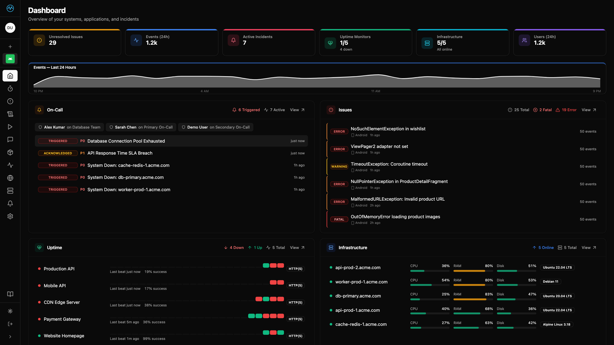
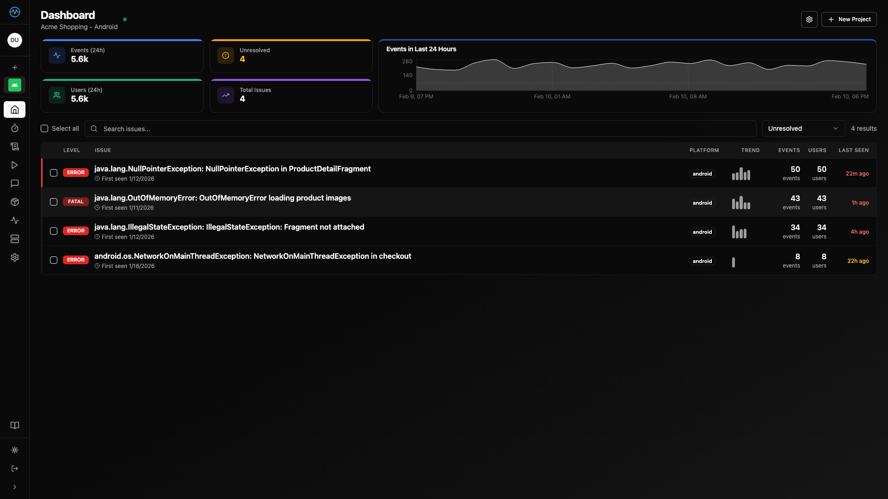
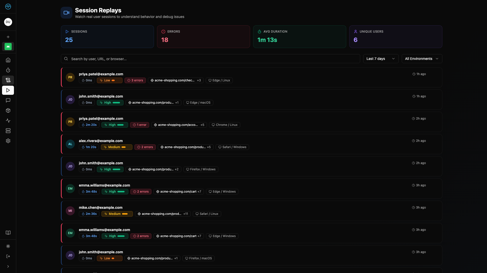
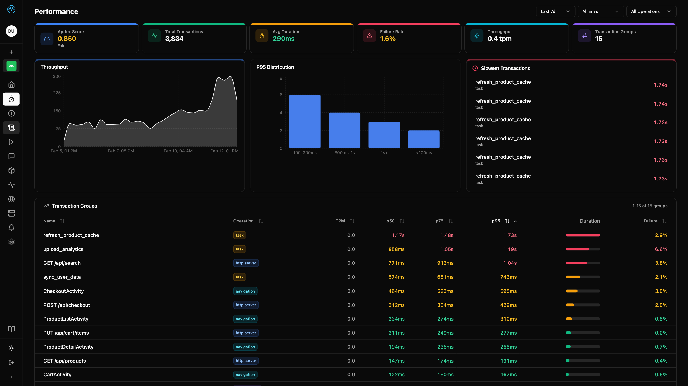
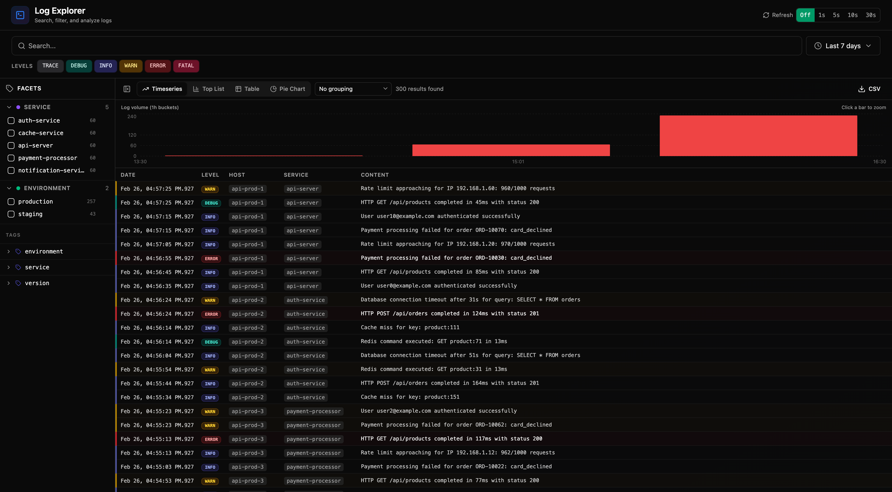
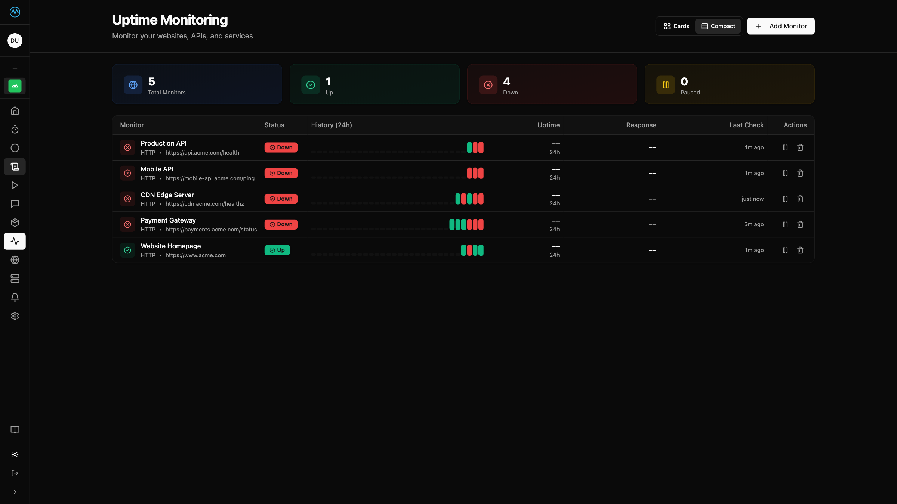
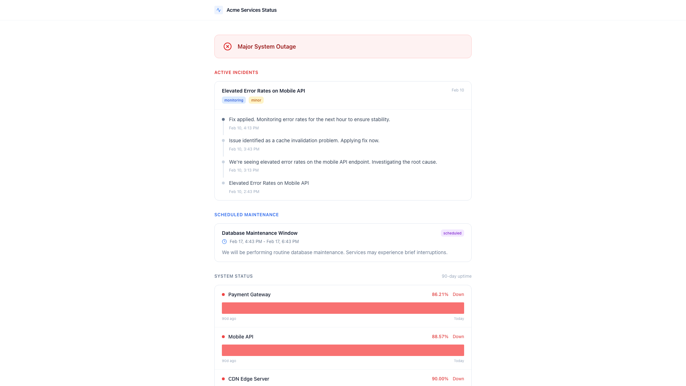
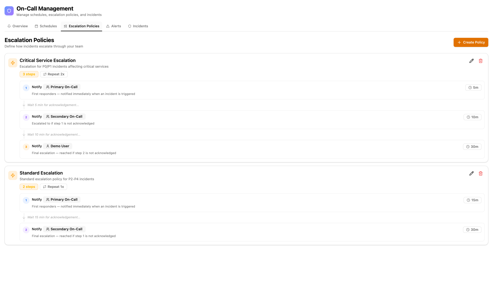

<p align="center">
  <a href="https://moneat.io">
    
  </a>
</p>

<p align="center">
  <em>Open-source, self-hostable observability. Errors, replays, performance, logs, uptime, and incidents — all in one place.</em>
</p>

<p align="center">
  <a href="https://www.gnu.org/licenses/agpl-3.0"></a>
  <a href="https://github.com/moneat-io/moneat/pulls"></a>
  <a href="https://discord.gg/Fanh3mem"></a>
  <a href="https://github.com/moneat-io/moneat/commits"></a>
  <a href="https://github.com/moneat-io/moneat/stargazers"></a>
</p>

<p align="center">
  <a href="https://moneat.io/docs"><b>Docs</b></a> ·
  <a href="https://github.com/moneat-io/moneat/issues/new?labels=enhancement&template=feature_request.md"><b>Feature Request</b></a> ·
  <a href="https://github.com/moneat-io/moneat/issues/new?labels=bug&template=bug_report.md"><b>Bug Report</b></a>
</p>

---

# Moneat: The open-source, self-hostable observability platform.

Moneat is the monitoring tool you wished you had — a self-hostable, Sentry SDK & Datadog Agent compatible observability platform.

**What you get out of the box:**

- [**Error Monitoring**](#error-monitoring) — Sentry-compatible, drop-in error tracking
- [**Session Replay**](#session-replay) — See exactly what users did before the crash
- [**Performance Monitoring**](#performance-monitoring) — Trace slow transactions and bottlenecks
- [**Logging**](#logging) — Centralized, searchable log management
- [**Uptime Monitoring & Status Pages**](#uptime-monitoring--status-pages) — Know when things go down, tell users what's up
- [**Custom Dashboards**](#custom-dashboards) — Build your own views with drag-and-drop widgets. Supports importing entire Grafana dashboards with 15+ custom datasources. 
- [**Product Analytics**](#product-analytics) — Understand user behavior with funnels, retention, and event tracking
- [**AI Observability**](#ai-observability) — Trace and debug LLM calls
- [**On-Call & Incident Management**](#on-call--incident-management-enterprise) — PagerDuty-style escalations (Enterprise)
- [**Datadog Compatibility**](#datadog-compatibility-enterprise) — Drop your Datadog agent into Moneat with no code changes (Enterprise)

---

## Table of Contents

- [Get Started](#get-started)
- [Features](#features)
  - [Error Monitoring](#error-monitoring)
  - [Session Replay](#session-replay)
  - [Performance Monitoring](#performance-monitoring)
  - [Logging](#logging)
  - [Uptime Monitoring & Status Pages](#uptime-monitoring--status-pages)
  - [Custom Dashboards](#custom-dashboards)
  - [Product Analytics](#product-analytics)
  - [AI Observability](#ai-observability)
  - [On-Call & Incident Management (Enterprise)](#on-call--incident-management-enterprise)
  - [Datadog Compatibility (Enterprise)](#datadog-compatibility-enterprise)
  - [Terraform Provider](#terraform-provider)
- [Sentry Compatibility](#sentry-compatibility)
- [Architecture](#architecture)
- [Screenshots](#screenshots)
- [Contributing](#contributing)
- [License](#license)

---

## Get Started

### Self-Hosted

Deploy Moneat on any VPS with Docker Compose.

```bash
git clone -b main https://github.com/moneat-io/moneat.git
cd moneat-deploy
cp .env.example .env   # then edit .env with your production secrets
docker-compose up -d
```

> **Note:** Always use the `main` branch for self-hosting — it tracks the current production release. The `develop` branch is unstable and intended for active development only.

### Telemetry

Self-hosted Moneat deployments collect anonymous usage telemetry to help us understand how Moneat is deployed and which features are most valuable. This data is never tied to individual users — only to a randomly-generated deployment identifier.

**What we collect:**
- System info: CPU count, memory usage, OS, JVM version
- Aggregate counts: projects, users, events, issues
- Deployment config: whether SSL is enabled

**What we don't collect:**
- No user emails, names, or any personal data
- No event contents, stack traces, or session replays
- No API keys or secrets

To opt out, set the following in your `.env`:

```bash
TELEMETRY_ENABLED=false
```

### Development Setup

For active development, run infrastructure in Docker but the backend and dashboard locally for hot-reload.

<details>
<summary><b>Prerequisites</b></summary>

- Docker and Docker Compose
- Java 17+
- Node.js 18+

</details>

```bash
# 1. Create your local environment config
cp .env.example .env

# 2. Start infrastructure only (PostgreSQL, ClickHouse, Redis)
docker compose up -d postgres clickhouse redis

# 3. Start the backend with hot-reload (API at localhost:8080)
cd backend && ./gradlew run

# 4. Start the dashboard with hot-reload (UI at localhost:5173)
cd dashboard && npm install && npm run dev
```

### Enterprise

Need SSO, on-call, incident management, or Datadog compatibility? Check out the [Enterprise plan](https://moneat.io/pricing) or contact [support@moneat.io](mailto:support@moneat.io).

---

## Features

### Error Monitoring

**Know when things break — and why.**

- Sentry-compatible ingestion — use your existing SDKs, zero migration effort
- Automatic error grouping with smart fingerprinting (exception type, message, stack frames)
- Issue management with resolve, unresolve, and ignore workflows
- Source map upload and release tracking for readable JavaScript stack traces
- Real-time alerting via email, Slack, and webhooks
- ClickHouse-powered analytics

→ [Error Monitoring docs](https://moneat.io/docs)

### Session Replay

**Understand what users actually did.**

- DOM-based session recordings with privacy controls
- Replay linked directly to error events — jump to the exact moment a crash happened
- Network request waterfall overlay
- Click and navigation breadcrumbs
- Console log capture with filtering

→ [Session Replay docs](https://moneat.io/docs)

### Performance Monitoring

**Find the slow spots.**

- Distributed tracing with transaction and span breakdowns
- Percentile-based latency analysis (p50, p75, p95, p99)
- Database query performance tracking
- Automatic slow-transaction detection with alerting
- Powered by ClickHouse for fast aggregation over high-cardinality data

→ [Performance docs](https://moneat.io/docs)

### Logging

**Centralized logs, actually searchable.**

- Ingest logs from any source via Sentry SDK or OpenTelemetry
- Full-text search across all log entries with ClickHouse
- Log correlation with errors, traces, and sessions
- Severity-level filtering and structured log support
- Retention policies for cost-efficient storage

→ [Logging docs](https://moneat.io/docs)

### Uptime Monitoring & Status Pages

**Know when things go down. Tell users what's up.**

- HTTP, TCP, and ping monitoring with configurable intervals
- Multi-region uptime checks for global coverage
- Public and private status pages with customizable branding
- Incident communication with automated status updates
- Alerting via email, Slack, and webhooks on downtime events

→ [Uptime docs](https://moneat.io/docs)

### AI Observability

**Debug your LLM pipelines.**

- Trace LLM calls with input/output token counts and latency
- Visualize multi-step AI agent chains and tool calls
- Track model performance, cost, and error rates over time
- Compatible with OpenTelemetry-based LLM tracing standards

→ [AI Observability docs](https://moneat.io/docs)

### Custom Dashboards

**Build the views that matter to you.**

- Drag-and-drop widget builder with charts, tables, and counters
- Query any data stored in ClickHouse — errors, logs, spans, and custom events
- Pre-built templates for common use cases (release health, API performance, infrastructure)
- Share dashboards across your team or make them personal
- Auto-refreshing dashboards for live monitoring on big screens

→ [Custom Dashboards docs](https://moneat.io/docs)

### Product Analytics

**Understand how users interact with your product.**

- Event-based tracking with custom properties and user identification
- Funnel analysis to measure conversion across multi-step flows
- Retention cohort charts to track user engagement over time
- Trend analysis with breakdowns by any event property
- Seamlessly correlates with error and performance data for full-stack visibility

→ [Product Analytics docs](https://moneat.io/docs)

### On-Call & Incident Management (Enterprise)

**PagerDuty-style on-call, built right in.**

- On-call schedules with rotation support (daily, weekly, custom)
- Priority-based escalation policies (P0–P5) with business hours
- Incident timeline and full audit trail
- Push notifications, Slack DM integration, and Twilio SMS
- SSO/SAML/OIDC authentication
- Native Slack integration for acknowledgment and resolution from chat

→ [Enterprise pricing](https://moneat.io/pricing) · [Contact sales](mailto:support@moneat.io)

---

### Datadog Compatibility (Enterprise)

**Point your Datadog agent at Moneat — no code changes required.**

Moneat Enterprise implements the Datadog agent ingestion protocol end-to-end, so you can redirect any existing Datadog agent deployment to your self-hosted Moneat instance. Configure your agent's `dd_url` / `apm_config.apm_dd_url` to your Moneat host and everything starts flowing immediately.

**Metrics**
- Full metrics API compatibility (v1, v2, v3 series) — gauges, counts, rates
- DogStatsD proxy endpoint for application-emitted custom metrics
- Distribution metrics and sketches (percentile aggregation)

**APM & Tracing**
- Trace ingestion across all agent wire formats (v0.3–v0.7, msgpack and JSON)
- Trace stats aggregation for service-level throughput and error rates
- Service dependency map — visualize upstream/downstream call graphs
- Trace detail view with span waterfall, tags, and resource breakdown

**Continuous Profiler**
- CPU, heap, allocation, goroutine, and blocking profile ingestion
- Flamegraph visualization in the dashboard (pprof and Sentry profile formats)
- Filter by service, environment, and profile type

**Logs**
- Log ingestion via the Datadog agent log collector (v2 API)
- Full-text search, severity filtering, and retention policies — same pipeline as Sentry logs

**Infrastructure**
- Host metadata collection (OS, platform, CPU, memory, agent version)
- Per-host metric history — CPU, memory, disk, network, load (5-minute buckets)
- Container stats — name, image, state, CPU, memory, and network I/O
- Process list with CPU/memory, command, user, thread count, and open file descriptors
- Network connections with protocol, direction, and byte counters

**Events & Service Checks**
- Infrastructure events (v1 `check_run` and v2 `events` / `service_checks`)
- Filterable event timeline in the dashboard

**Database Monitoring (DBM)**
- Query samples and execution plans from the Datadog Database Monitoring agent
- Query metrics aggregation and active session tracking
- Schema and metadata ingestion for query explain support

**Network Device Monitoring (NDM)**
- SNMP device discovery — vendor, model, OS version, reachability
- SNMP trap ingestion with severity and OID
- NetFlow / sFlow network flow records
- Network path topology (traceroute-style hops and RTTs)

**Cloud Security Management (CSM)**
- Runtime security event ingestion with rule name, category, and severity
- Activity dump collection for forensic process trees
- Compliance finding ingestion (CIS, PCI-DSS, SOC 2, etc.) with pass/fail/skip status
- Compliance summary view grouped by framework

**Kubernetes Orchestration**
- Kubernetes resource and manifest payloads from the Datadog orchestrator check

→ [Enterprise pricing](https://moneat.io/pricing) · [Contact sales](mailto:support@moneat.io)

### Terraform Provider

Manage your Moneat infrastructure as code with the official Terraform provider. Configure projects, uptime monitors, status pages, dashboards, alerts, and more — all from your Terraform configurations.

```hcl
resource "moneat_project" "backend" {
  name     = "backend-api"
  platform = "python"
}

resource "moneat_uptime_monitor" "api_health" {
  name             = "API Health Check"
  url              = "https://api.example.com/health"
  type             = "http"
  interval_seconds = 60
}
```

- **[Terraform Registry](https://registry.terraform.io/providers/moneat-io/moneat/latest)** — Install and docs
- **[GitHub Repository](https://github.com/moneat-io/terraform-provider-moneat)** — Source code and issues
- **[Provider Documentation](https://registry.terraform.io/providers/moneat-io/moneat/latest/docs)** — Full resource reference

---

## Sentry Compatibility

Moneat implements the **Sentry ingestion API** (envelope and legacy store endpoints), so you can use existing Sentry SDKs with zero code changes. Just point your DSN at your Moneat instance.

```javascript
// Example: JavaScript SDK — just change the DSN
Sentry.init({
  dsn: "https://<key>@<your-moneat-host>/api/<project-id>",
});
```

**Supported SDKs:**

| Platform | SDK |
|----------|-----|
| JavaScript / TypeScript | `@sentry/browser`, `@sentry/node`, `@sentry/react`, `@sentry/nextjs` |
| Python | `sentry-sdk` |
| Kotlin / Java | `sentry-kotlin`, `sentry-java` |
| Android | `sentry-android` |
| iOS / macOS | `sentry-cocoa` |
| Go | `sentry-go` |
| Ruby | `sentry-ruby` |
| .NET | `Sentry.NET` |

Any SDK that sends to the standard Sentry envelope endpoint should work out of the box.

---

## Architecture

```
moneat/
├── backend/                 # Kotlin/Ktor backend (AGPLv3)
├── dashboard/               # React frontend (AGPLv3)
├── docs/                    # Docusaurus documentation (served at /docs/)
├── emails/                  # Maizzle email templates
├── e2e/                     # E2E test apps (web, Android, KMP)
└── docker-compose.yml       # Local development infrastructure
```

### Tech Stack

| Layer | Technology |
|-------|-----------|
| Backend | Kotlin 2.3.x, Ktor 3.4.x, Exposed |
| Operational DB | PostgreSQL 18 |
| Analytics DB | ClickHouse 26 |
| Cache & Queue | Redis |
| Frontend | React 18, TypeScript, TanStack Router/Query, shadcn/ui, Radix, TailwindCSS, Vite |
| Email Templates | Maizzle |
| Billing | Stripe |
| Notifications | Twilio (SMS), Slack, Push |
| Observability | OpenTelemetry, Sentry self-monitoring |

Production deployment configuration lives in the separate repository.

---

## Screenshots

<p align="center">
  
</p>

<p align="center">
  
</p>

<p align="center">
  
</p>

<p align="center">
  
</p>

<p align="center">
  
</p>

<p align="center">
  
  
</p>

<p align="center">
  
</p>

---

## Contributing

We welcome contributions! Whether it's a bug fix, feature, or documentation improvement — we'd love your help.

1. Read the [Contributing Guide](CONTRIBUTING.md)
2. Sign our [Contributor License Agreement (CLA)](CLA.md)
3. Open a PR

---

## License

Copyright © 2026 Moneat

All code in this repository is licensed under the [GNU Affero General Public License v3.0](LICENSE). Self-host, modify, and redistribute freely — modifications must be shared under the same license when used to provide a network service.

For licensing questions, contact [licensing@moneat.io](mailto:licensing@moneat.io).

---

## Trademarks

Sentry is a registered trademark of Functional Software, Inc. Datadog is a registered trademark of Datadog, Inc. PagerDuty is a registered trademark of PagerDuty, Inc. All other trademarks are the property of their respective owners. Moneat is not affiliated with, endorsed by, or sponsored by any of these companies. Use of these names is solely for the purpose of describing compatibility.
