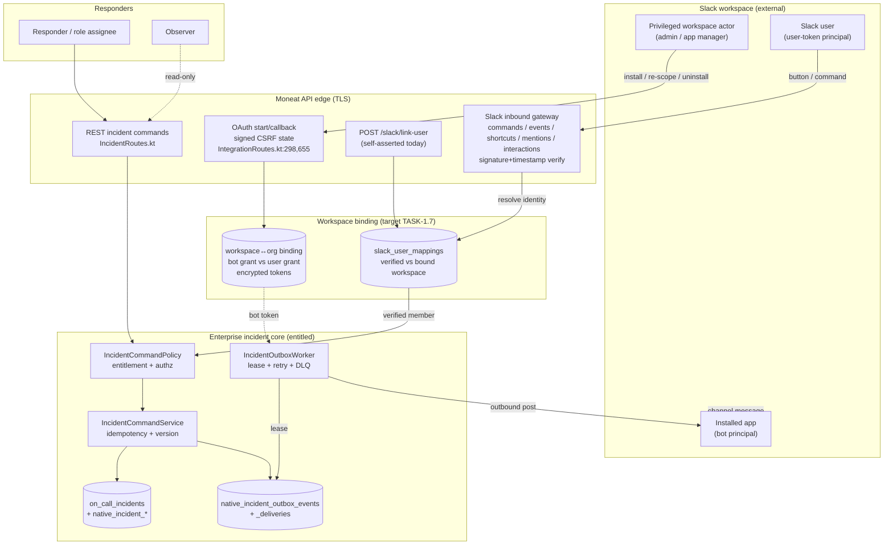
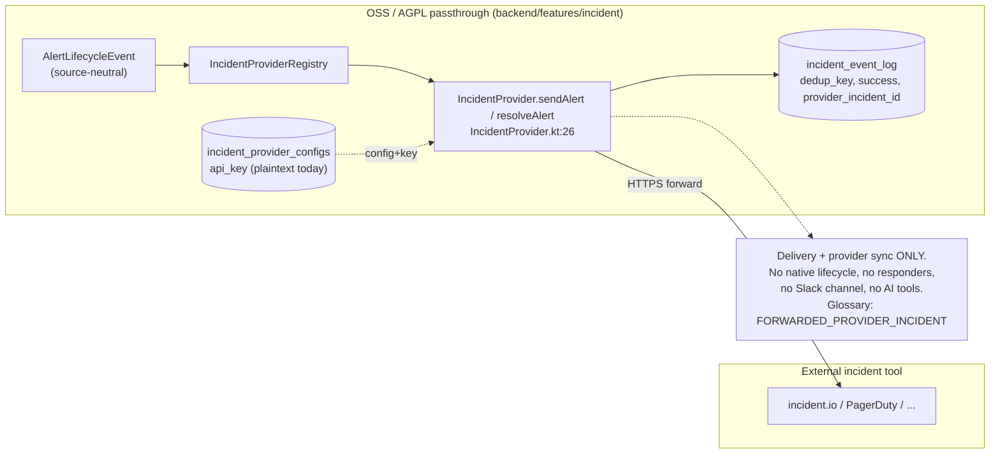
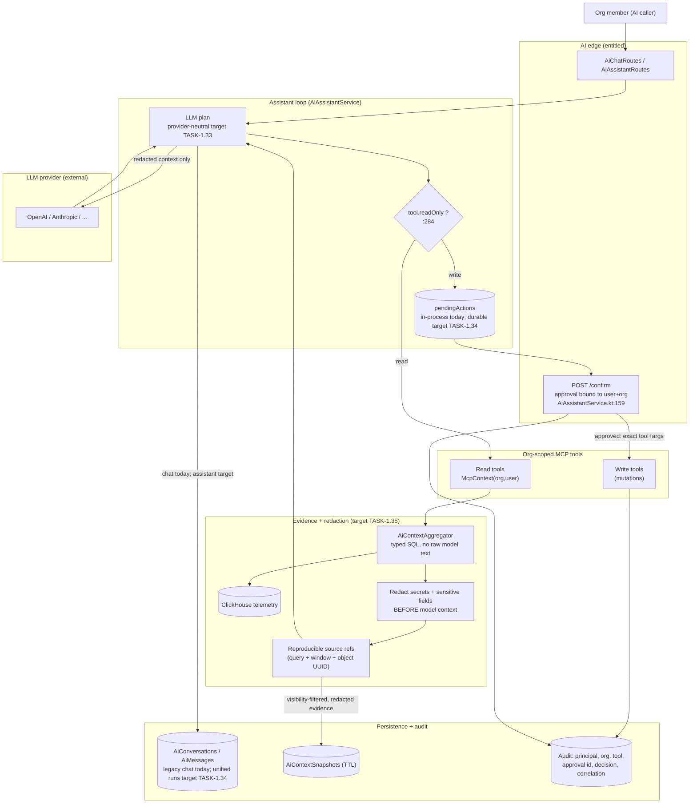

# Incident Response Threat Model — Slack, Native Incidents, and AI Boundaries

- **Backlog task:** TASK-1.41 — *Threat-model Slack, incident, and AI boundaries*
- **Status:** Design artifact. Mixes **current code** (verified against the repository) with **target requirements** (planned, not yet implemented).
- **Hardening & verification owner:** **TASK-1.48**. Feature tasks (see [§1.3](#13-owning-tasks)) own first implementation; TASK-1.48 owns end-to-end verification of every mitigation and every threat ID below.
- **Audience:** engineers implementing incident response across Slack, native incidents, status communication, files/exports/calls, workflows, and AI retrieval/tools. This document is intended to be complete enough that TASK-1.48 can implement and verify mitigations **without reopening architecture or scope decisions** — those are settled in [§10](#10-architecture-decisions-settled).

---

## 1. Purpose, scope, non-goals, assumptions

### 1.1 Purpose

Establish the trust boundaries, assets, actors, authorization rules, threats, controls, and verification plan for Moneat incident response. Incident response spans Slack (inbound + outbound), the native incident aggregate, status communication, files/exports, calls/transcripts, workflows, AI retrieval and tools, approvals, and retention.

Two incident systems coexist and **must not be conflated**:

1. **Native incidents** — the canonical enterprise incident-response aggregate. Entitlement/tier gated exactly like on-call. Verified: `ee/backend/src/main/kotlin/com/moneat/enterprise/incidents/**`, gated via `IncidentCommandPolicy` → `FeatureRegistry.hasModule("On-Call")` (`ee/.../incidents/commands/IncidentCommandPolicy.kt:18-23`).
2. **OSS external incident-provider passthrough** — the free AGPL path that forwards alert lifecycle events to third-party incident tools (incident.io, PagerDuty, …). Verified: `backend/features/incident/**` and `backend/src/main/kotlin/com/moneat/incident/**`; interface `IncidentProvider` (`backend/.../incident/services/IncidentProvider.kt:26`). It performs *delivery and provider synchronization only*.

The domain glossary encodes this split as first-class canonical objects: `NATIVE_INCIDENT` vs `FORWARDED_PROVIDER_INCIDENT` (`ee/.../incidents/IncidentDomainGlossary.kt:13-22`).

### 1.2 Scope

- Native incident lifecycle: declare → triage → active → resolved → post-incident → closed, plus cancel/decline/merge/reopen (`NativeIncidentStatus`, `ee/.../incidents/models/IncidentModels.kt:19-36`).
- Native incident command/idempotency/outbox pipeline (`IncidentCommandService`, `IncidentOutboxService`).
- Slack installation, OAuth, inbound interactivity, outbound messaging, identity mapping.
- Responder model: roles, assignments, participants, observers, handovers (`ee/.../incidents/responders/**`).
- Status-page communication, files/exports, calls/transcripts (Twilio), retention/deletion.
- AI incident retrieval, org-scoped tools, evidence references, redaction, approvals, persistence, audit (`ee/backend/.../ai/**`).
- Workflow/webhook egress triggered by incidents (`WorkflowIncidentEventConsumer`, `WorkflowEgressActionExecutor`).
- The boundary between native incidents and the OSS passthrough.

### 1.3 Owning tasks

The Backlog is authoritative for task boundaries. The security-relevant owners are mapped below so the threat register does not invent a parallel decomposition.

| Task | Scope | Status |
|------|-------|--------|
| TASK-1.2 | Incident command policy, authorization, concurrency, and idempotency | In progress |
| TASK-1.7 | Slack installation, scopes, workspace bindings, token health, and privileged installation access | In progress |
| TASK-1.8 | Durable authenticated inbound Slack gateway, including replay protection | Implemented |
| TASK-1.9 | Slack identity, responder permissions, and private-incident access | Planned |
| TASK-1.10 | Durable outbound Slack delivery and reconciliation | Planned |
| TASK-1.11–1.22 | Incident-channel provisioning and Slack responder feature surfaces; each task owns authorization and safe rendering for its own actions/messages | Planned |
| TASK-1.23 | Incident-lifecycle workflows and egress | Planned |
| TASK-1.24 / 1.40 | Incident calls, war rooms, transcription, and live notes | Planned |
| TASK-1.25 / 1.26 | Status-page and stakeholder/private communication | Planned |
| TASK-1.30 / 1.31 | Postmortem files, reports, timeline curation, provenance, and export | Planned |
| TASK-1.33 | Provider-neutral AI runtime | In progress |
| TASK-1.34 | Durable AI conversations, runs, tool calls, and approvals | In progress |
| TASK-1.35 | Scoped incident evidence and action tools, citations, and redaction | In progress |
| TASK-1.36–1.39 | Evidence-linked AI summaries, triage, investigations, and dashboard/Slack chat | Planned |
| TASK-1.41 | This threat model | Current (this doc) |
| TASK-1.42 | Incident-response administration and versioned settings | Planned |
| TASK-1.44 | End-to-end incident response simulation suite used by security verification | Planned |
| TASK-1.46 | Native/forwarded incident, alert, and episode disambiguation | Done |
| TASK-1.47 | Durable incident domain events and transactional outbox | Done |
| TASK-1.48 | **Hardening & verification** — owns automated tests, integration simulations, operational metrics/alerts, and manual security tests for every threat ID | Planned |
| TASK-1.49 / 1.50 | Enterprise entitlements, quotas, and usage accounting; native response is enabled by entitlement without a rollout gate | Done |

### 1.4 Non-goals

- Rewriting the OSS passthrough into a native workflow. The passthrough stays AGPL and delivery-only.
- Building a general-purpose Slack app platform. Only incident-response and alert flows are in scope.
- Model/provider selection quality, prompt tuning, or LLM cost governance (tracked separately: `ee/.../ai/llm/costs/**`).
- DoS/DDoS resilience (explicitly out of scope in `SECURITY.md`), except where idempotency/rate-limit reconciliation is a correctness requirement.
- Endpoint/agent security and SSO/RBAC internals beyond how they name incident principals.

### 1.5 Assumptions

- TLS terminates in front of the API; server-to-server calls to Slack/Twilio/LLM providers use HTTPS.
- Postgres is the system of record for incident aggregate + outbox; ClickHouse holds observability telemetry consumed as AI evidence.
- `JWT_SECRET` and `SLACK_SIGNING_SECRET` are configured in production (`getStateSecret()` fails closed if `JWT_SECRET` is blank — `backend/.../org/routes/IntegrationRoutes.kt:127-133`).
- Every new incident-response entity is keyed externally by its `resource_id` UUID, never by the integer surrogate (verified convention: `resource_id` columns across `OnCallIncidents` and all native incident tables, e.g. `OnCallSharedModels.kt:118`). Public API surfaces use resource UUIDs and derive organization scope from the authenticated context; server-side audit records retain the organization id for attribution.
- The enterprise module may be absent (OSS-only deploy). All native-incident and AI code paths must degrade to "requires Enterprise" and must never be reachable without the entitlement.

### 1.6 Current-versus-target summary

| Capability | Current code | Target requirement | Gap owner |
|---|---|---|---|
| Native incident aggregate, idempotency, optimistic concurrency, outbox | **Implemented** (`IncidentCommandService`, `IncidentOutboxService`) | Keep; extend to Slack consumer | TASK-1.2 / 1.10 / 1.47 |
| Entitlement gating of native incidents | **Implemented** (`IncidentCommandPolicy`) | Keep; add per-command authorization beyond "member of org" | TASK-1.2 / 1.50 |
| Command authorization granularity | **Coarse**: authorizer allows any `org>0 && user>0` actor (`IncidentCommandPolicy.kt:21-23`) | Role/visibility-aware authorization per command type | TASK-1.2 / 1.9 |
| Private incident visibility (`PRIVATE`) | **Stored, not enforced on read**: incident reads filter by org only (`OnCallIncidentService.kt:148-256`); timeline list/export/revisions resolve the incident in-org but do not apply caller or event visibility, and export includes deleted events (`IncidentTimelineRoutes.kt`, `IncidentTimelineService.export`) | Enforce membership-gated read/list/timeline/revision/export/metadata for `PRIVATE`, `PARTICIPANTS`, and deleted entries | TASK-1.9 |
| Slack signature/timestamp/replay verification (inbound) | **Implemented** for commands, events, shortcuts, mentions, and interactions through `SlackInboundGateway` (300s window, constant-time compare, durable delivery-key deduplication) | Keep; bind every delivery to the verified workspace identity and downstream command idempotency | TASK-1.7 / 1.9 |
| Slack workspace install model | **Single bot token per org** in `organization_integrations.access_token`, plaintext (`IntegrationRoutes.kt:732`) | Workspace = explicit principal; **distinct bot vs user grants**; explicit workspace↔org bindings; encrypted at rest | TASK-1.7 |
| Slack identity mapping | **Self-asserted, not workspace-verified, not org-scoped** (`SlackUserMappings`, `/slack/link-user` — `IntegrationRoutes.kt:1017-1084`) | Resolve `team_id` to a workspace binding, then key verified mappings and every lookup/write by `(workspace_binding_id, slack_user_id)`; handle guests/Connect/stale users | TASK-1.9 |
| Token storage | **Plaintext** Slack token + OSS provider `api_key` (`incident_provider_configs.api_key`) | Encrypt integration secrets with dedicated per-purpose keys; never return plaintext from management APIs | TASK-1.7 / 1.48 |
| AI provider neutrality | **Partial**: the enterprise AI package has an OpenAI/Anthropic `LlmProvider` abstraction (`ee/.../ai/llm/LlmProvider.kt`), but all AI entry points are not yet unified behind it | Complete the provider-neutral runtime | TASK-1.33 |
| AI org-scoped tools | **Implemented** for existing tools (`McpContext.organizationId/userId` — `ee/.../oncall/mcp/OnCallTool.kt:66-70`) | Add incident-specific evidence/action tools with private-incident visibility enforcement | TASK-1.35 |
| AI write-tool approval | **Implemented in process memory** in the current assistant loop (`!definition.readOnly` ⇒ confirmation; bound to user+org; single-use — `AiAssistantService.kt:159-220, 284-301`) | Persist approvals; bind exact arguments; add expiry and audit | TASK-1.34 / 1.35 |
| AI snapshot confirmation scope | **User-scoped but not organization-scoped**: the route resolves the current org, but `resolveSnapshotId`/`loadSnapshot`/`confirmSnapshot` filter by snapshot + user only (`AiChatRoutes.kt:106-135`, `AiContextSnapshotService.kt:81-128`) | Bind confirmation to snapshot + user + current org and re-check membership before returning stored evidence | TASK-1.34 / 1.35 |
| AI evidence source references | **Partial**: context snapshot with per-source counts (`EnterpriseAiChatService.kt:162-165`); **no per-claim reproducible citation** | Every factual claim carries a reproducible source reference (query + time window + object UUID) | TASK-1.35 / 1.36 |
| AI redaction of secrets/sensitive fields | **Not implemented on this branch** (no `redact` in `ee/.../ai/**`) | Redact secrets and configured sensitive fields before model context | TASK-1.35 |
| Outbound Slack egress / SSRF for incident links | Backend validates `http(s)` scheme for incident source URLs (`IncidentCommandService.kt:979-984,1178`); frontend `parseHttpUrl` (`dashboard/.../on-call/safe-url.ts`) | Keep; route incident webhooks through the isolated egress worker (`WorkflowEgressActionExecutor`) | TASK-1.23 / 1.48 |

---

## 2. Assets, classifications, actors, entry points, invariants

### 2.1 Assets and data classification

| Asset | Store / path | Classification |
|---|---|---|
| Native incident aggregate (title, summary, severity, status, mode, **visibility**) | `on_call_incidents` (`OnCallSharedModels.kt:117`) | Internal; **PRIVATE** rows are Confidential |
| Incident declaration form values | `native_incident_form_submissions` (`IncidentCommandService.kt:210-221`) | Confidential (may contain customer/PII detail) |
| Incident timeline (with provenance + visibility) | `on_call_incident_timeline`, `IncidentTimelineProvenance`/`IncidentTimelineVisibility` (`IncidentTimelineModels.kt:37-52`) | Internal → Confidential; `PRIVATE`/`PARTICIPANTS` values are stored but not yet enforced on reads/exports |
| Responder roles, assignments, participants, observers, handovers | `native_incident_role_*`, `native_incident_participants`, `native_incident_handovers` (`IncidentResponderModels.kt`) | Internal (membership metadata is a side channel — see INC-04) |
| Incident sources / evidence links | `native_incident_source_links` (URL, Slack message, alert, episode — `IncidentTimelineModels.kt:28-34,65-79`) | Internal; URLs are untrusted input |
| Command ledger (idempotency + fingerprint) | `native_incident_commands` (`IncidentModels.kt:79-98`) | Internal |
| Outbox events + per-consumer deliveries | `native_incident_outbox_events`, `native_incident_outbox_deliveries` (`IncidentModels.kt:107-159`) | Internal |
| Security audit trail | Separate append-only, HMAC-chained audit store (target — TASK-1.48), correlated to but independent from the editable timeline | Confidential |
| Slack bot token | `organization_integrations.access_token` (**plaintext today**) | **Secret** |
| Slack user↔Moneat mapping | `slack_user_mappings` | Confidential (identity linkage) |
| OSS provider API key | `incident_provider_configs.api_key` (**plaintext today**) | **Secret** |
| Twilio call/SMS credentials + transcripts | `TwilioService`, call/gather webhooks (`ee/.../oncall/routes/TwilioWebhookRoutes.kt`) | **Secret** (creds) / Confidential (transcripts) |
| AI conversations + messages | `AiConversations`, `AiMessages` (`EnterpriseAiChatService.kt:323-372`) | Confidential (may embed evidence + prompts) |
| AI context snapshots | `AiContextSnapshotService` (TTL cleanup, `AiModels.kt:46`) | Confidential |
| Files / exports | Timeline JSON export exists (`IncidentTimelineRoutes.kt`); postmortem reports and attachments are targets (TASK-1.30 / 1.31) | Confidential |
| Public status and private stakeholder updates | *Target* (TASK-1.25 / 1.26) | Public only after explicit sanitization; otherwise Confidential |
| OAuth/CSRF state secret, signing secrets | `JWT_SECRET`, `SLACK_SIGNING_SECRET` env | **Secret** |

### 2.2 Actors and principals

**Moneat principals**
- **Org member** — authenticated user with a `Memberships` row (`IncidentCommandService.requireActorMembership`, `:154-166`).
- **Responder** — member holding a current role assignment (`NativeIncidentRoleAssignments`, ended_at null).
- **Observer** — member with `IncidentParticipationType.OBSERVER` (`IncidentResponderModels.kt:17-20`).
- **Role assignee** — member holding a specific incident role (incident commander, comms lead, …).
- **Org admin** — elevated org role (`OrgRole`, resolved in `IncidentRoutes.kt:398-407`).
- **AI caller** — a member driving the assistant; tools run under `McpContext(organizationId, userId)`.
- **MCP API-key principal** — machine caller with configured read/write scopes (`backend/features/mcp/.../auth/McpScopes.kt:239`); dedicated incident scopes are a TASK-1.35 target.

**Slack principals**
- **Bot principal** — the installed app's bot token; posts messages, joins channels.
- **User-token principal** — a Slack user acting via interactivity/commands (distinct from the bot; **not yet modeled as a separate grant** — TASK-1.7).
- **Privileged workspace actor** — Slack workspace admin/owner or app manager; can install/uninstall/re-scope the app.
- **Slack workspace** — the installation principal (team id). Target: an explicit binding object, not an attribute.

**External / provider principals**
- **LLM provider** — OpenAI/Anthropic/other (`LlmProviderFactory`).
- **OSS incident provider** — incident.io/PagerDuty endpoint receiving forwarded alerts.
- **Twilio** — voice/SMS callbacks.

### 2.3 Entry points (trust ingress)

| Entry point | Path | Trust |
|---|---|---|
| REST incident commands | `ee/.../oncall/routes/IncidentRoutes.kt` (JWT) | Authenticated member |
| Slack OAuth start/callback | `/slack/oauth/start`, `/slack/oauth/callback` (`IntegrationRoutes.kt:298,655`) | Signed-state CSRF-bound |
| Slack inbound gateway | `POST /slack/commands`, `/slack/events`, `/slack/shortcuts`, `/slack/mentions`, `/slack/interactions` (`IntegrationRoutes.kt`) | Slack-signed body; durable delivery record before asynchronous processing |
| Slack user link | `POST /slack/link-user` (`IntegrationRoutes.kt:1017`) | Authenticated member (self-asserted mapping) |
| Twilio webhooks | `/sms-status`, `/call-status`, `/gather` (`TwilioWebhookRoutes.kt`) | Twilio-signed (`X-Twilio-Signature`) |
| AI chat / assistant | `ee/.../ai/routes/AiChatRoutes.kt`, `AiAssistantRoutes.kt` | Authenticated member |
| AI tool confirmation | `POST /confirm` (`AiAssistantRoutes.kt:105`) | Authenticated member; request bound to user+org |
| Outbox worker | `IncidentOutboxWorker` (internal, leased) | Trusted internal |
| Workflow egress | `WorkflowEgressActionExecutor` (isolated worker) | Semi-trusted, network-isolated |

### 2.4 Security invariants (must always hold)

- **INV-1 Entitlement:** no native-incident or enterprise-AI code path executes unless the org holds the module (`IncidentCommandPolicy` fails closed; `FeatureRegistry.getOnCallBridge()==null` ⇒ feature unavailable, `IntegrationRoutes.kt:936-946`).
- **INV-2 Org isolation:** every single-object read/write is scoped by `organization_id` **and** the object's resource/internal id in the same predicate (`requireIncident(org,id)` — `IncidentCommandService.kt:859-865`; `versionPredicate` — `:892-895`). Collection reads, searches, and counts are scoped by `organization_id` plus caller visibility/membership predicates. Tests cover both query forms. No cross-org object may be named, mutated, referenced, listed, searched, or counted.
- **INV-3 Actor membership:** the acting user must be a member of the incident's org (`requireActorMembership` / `requireUserMembership` — `:154-166, 874-883`).
- **INV-4 Idempotency:** `(organization_id, command_key)` is unique; replays return the prior result iff `command_type` and request fingerprint match, else conflict (`IncidentCommandService.execute/replayResult` — `:55-152`).
- **INV-5 Optimistic concurrency:** mutations carry `expected_version`; a version-guarded UPDATE that affects 0 rows raises conflict (`requireVersionUpdate` — `:897-901`).
- **INV-6 Outbox at-least-once processing:** domain events are written in the aggregate transaction; database delivery claims are per-consumer and idempotent on `delivery_key`, leased, retried with backoff, and dead-lettered after `MAX_ATTEMPTS` (`IncidentOutboxService`). A database delivery key alone does **not** make an external call and completion update atomic. Each external consumer must use provider-side idempotency or durable operation-key reconciliation before retrying a possibly completed call.
- **INV-7 Inbound authenticity (target):** Slack callbacks are signature- and timestamp-verified before any side effect; Twilio callbacks are signature-verified and idempotency-protected. Secret comparisons are constant-time. Slack currently meets the signature/timestamp/constant-time portion; Twilio validates a signature but its ordinary string comparison and callback idempotency must be hardened under TASK-1.48.
- **INV-8 Principal separation:** bot-token actions and user-token actions are distinct principals; a Slack user's authority derives from a *verified* mapping to a Moneat member in the *bound* workspace, never from the bot's authority (target — TASK-1.7 / 1.9).
- **INV-9 AI evidence trust:** telemetry/evidence surfaced to the model is **data, not instructions**; every factual claim carries a reproducible source reference; secrets and configured sensitive fields are redacted before entering model context (target — TASK-1.35 / 1.36).
- **INV-10 AI mutation approval:** a model-proposed mutation executes only after an explicit human approval bound to the exact tool + arguments + user + org, single-use and expiring (`AiAssistantService` confirmation flow is the seam; durability/arg-binding is target — TASK-1.34 / 1.35).
- **INV-11 No secret/private-content logging:** logs and model context never contain tokens, signing secrets, private-incident bodies, or transcripts; they retain principal, org, object UUID, source, decision, command key, approval id, correlation id (see [§8](#8-logging-and-audit-rules)).
- **INV-12 Fail closed:** missing entitlement, missing signing secret, unverified signature, unmapped Slack user, absent enterprise bridge, or an unknown incident-domain object name ⇒ deny (`IncidentDomainGlossary.requireCanonicalApiName` throws on unknown — `:36-38`).

---

## 3. Data-flow and trust-boundary diagrams

### 3.1 Slack ⇄ native incidents, installation, queues/outbox, responders



### 3.2 OSS external incident-provider passthrough (separate from native incidents)



The two systems share **no tables and no lifecycle**. The only common vocabulary is the source-neutral `AlertLifecycleEvent`/`AlertEpisode`. Type confusion between them is threat **PASS-01/PASS-02**.

### 3.3 AI providers, retrieval/tools, evidence, redaction, approvals, persistence, audit



**Evidence trust boundary:** everything crossing `aggr → redact → refs → plan` is untrusted **data**. Telemetry text (log lines, span attributes, incident notes, Slack messages) may contain adversarial instructions; the model must treat it as quoted evidence, never as commands (INV-9, threat AI-01).

### 3.4 Status communication, calls/transcripts, files, and exports

```mermaid
flowchart LR
    subgraph core["Native incident core (trusted)"]
        incident[("Incident aggregate + timeline")]
        authz["Visibility + role authorization<br/>TASK-1.9"]
        redact["Explicit selection + redaction"]
        audit[("Export / publish / call audit")]
    end

    subgraph internal["Confidential incident artifacts"]
        call["Call / war room<br/>TASK-1.24"]
        transcript[("Transcript + live notes<br/>TASK-1.40")]
        report["Postmortem / timeline export<br/>TASK-1.30 / 1.31"]
        files[("Private file storage")]
    end

    subgraph external["External trust boundaries"]
        twilio["Twilio / meeting provider"]
        download["Signed, expiring download"]
        status["Public status page<br/>TASK-1.25"]
        stakeholder["Subscribed stakeholder<br/>TASK-1.26"]
    end

    incident --> authz --> call --> twilio
    twilio -->|signed callback| transcript
    transcript --> files
    incident --> authz --> report --> files --> download
    incident --> redact --> status
    incident --> redact --> stakeholder
    call --> audit
    report --> audit
    status --> audit
    stakeholder --> audit
```

Only explicitly selected, visibility-authorized, redacted content may cross from the incident core into files, exports, calls, status communication, or stakeholder updates. Public status content is a separately authored projection, never an automatic mirror of an internal or private timeline.

---

## 4. Authorization matrices

Legend: ✅ allowed · ⛔ denied (fail closed) · 🔶 allowed only via explicit, audited elevation · N/A not applicable.

### 4.1 Native incident by visibility (target enforcement — TASK-1.9)

`ORGANIZATION` incidents are visible to all org members; `PRIVATE` restricts to explicitly involved principals; `PUBLIC` may expose sanitized status externally.

| Principal | ORG: read | ORG: write¹ | PRIVATE: read | PRIVATE: write¹ | Declare | Change visibility | Merge | Manage roles |
|---|---|---|---|---|---|---|---|---|
| Org admin | ✅ | ✅ | 🔶 (explicit + audited) | 🔶 | ✅ | ✅ | ✅ | ✅ |
| Responder / role assignee (this incident) | ✅ | ✅ | ✅ | ✅ | ✅ | 🔶 (commander only) | 🔶 | ✅ (own scope) |
| Observer (this incident) | ✅ | ⛔ | ✅ | ⛔ | N/A | ⛔ | ⛔ | ⛔ |
| Org member (not involved) | ✅ | ⛔ until explicitly assigned an authorized responder/role | ⛔ | ⛔ | ✅ | ⛔ | ⛔ | ⛔ |
| MCP write-key principal | ✅ | 🔶 (scope+approval) | ⛔ | ⛔ | 🔶 | ⛔ | ⛔ | ⛔ |
| AI caller (via tools) | ✅ (as user) | 🔶 (human approval) | ✅ iff user may | 🔶 (human approval) | 🔶 | ⛔ | ⛔ | 🔶 |
| Non-member / other org | ⛔ | ⛔ | ⛔ | ⛔ | ⛔ | ⛔ | ⛔ | ⛔ |

¹ *write* = update fields, transition status, add timeline/action, link/unlink source.

> **Current-state note:** today the authorizer treats any `org>0 && user>0` actor as allowed (`IncidentCommandPolicy.kt:21-23`) and reads filter by org only — so `PRIVATE` rows are currently readable by authenticated members reaching those organization-scoped paths. This matrix is the **target**; TASK-1.9 implements it. Threats: INC-02, INC-03, INC-04.

### 4.2 Slack identity → incident authority (target — TASK-1.7 / 1.9)

Resolution: inbound Slack `(team_id, slack_user_id)` → resolve `team_id` to the workspace binding → look up `(workspace_binding_id, slack_user_id)` in a **verified** mapping to a Moneat member → apply §4.1 as that member. Every mapping read/write uses that composite key. Bot identity never confers user authority.

| Slack identity | Maps to Moneat authority? | Incident actions | Rationale |
|---|---|---|---|
| Mapped full member, bound workspace | ✅ as that member | Per §4.1 | Verified linkage |
| Unmapped user, bound workspace | ⛔ | Prompt to link; no action | No identity ⇒ no authority (fail closed) |
| Guest / single-channel guest | ⛔ | None through the incident app | Guests are not Moneat members; do not expose incident or private content merely because a channel is visible |
| Slack Connect (external org) user | ⛔ | None | External principal; must never bind to internal member |
| Mapping to member of a **different** org | ⛔ | None | Cross-org confused deputy (IDN-02) |
| Removed/deactivated Slack user | ⛔ | None | Stale principal; mapping invalidated on uninstall/rotation |
| Stale mapping (member left org) | ⛔ | None | Membership re-checked at action time (INV-3) |
| Bot principal | N/A | Outbound posting only | Bot ≠ user; no incident mutation authority |
| User-token principal (delegated) | 🔶 only within granted scope | Only what the user consented to | Distinct grant from bot (INV-8) |
| Privileged workspace actor (admin) | 🔶 install/uninstall/scope only | No implicit incident authority | Workspace admin ≠ Moneat admin (IDN-05) |

> **Current-state note:** `getUserIdFromSlackUserId(slackUserId, slackTeamId)` matches globally on the mapping table, then derives org via `Memberships.selectAll().where { user_id eq userId }.singleOrNull()` (`IntegrationRoutes.kt:948-955, 1072-1084`) — which assumes a single membership and does **not** verify the team is bound to that org. Mappings are self-asserted via `/slack/link-user` with no workspace proof. Threats: IDN-01, IDN-02, IDN-03.

### 4.3 Slack inbound action authorization gate (per request)

| Check | Current | Target |
|---|---|---|
| Signature present + valid (constant-time) | ✅ `IntegrationRoutes.kt:171-174` | Keep |
| Timestamp within 300s | ✅ `:162` | Keep |
| Replay nonce not seen before | ⛔ (none) | Add short-TTL nonce cache (SLK-02) |
| `team_id` bound to target org | ⛔ | Add (IDN-02) |
| User mapping verified for that workspace | ⛔ (global match) | Add (IDN-01) |
| Member-of-org re-check at action time | ✅ for ack path (`:948-955`) | Keep + extend to all actions |
| Object belongs to resolved org | ✅ ack path cross-checks `alert.organizationId != userOrgId` (`:969-971`) | Keep as the model for every action |

---

## 5. Threat register (severity-ranked)

Severity = worst-case business impact × likelihood. **Verification evidence** names the concrete artifact TASK-1.48 must produce/observe.

### Critical

| ID | Scenario | Assets | Impact / Sev | Required mitigation | Owner(s) | Verification evidence |
|---|---|---|---|---|---|---|
| **IDN-02** | Slack `team_id` not verified against the org binding; a mapping (or forged interactivity) resolves a Slack user to a member of a *different* org, acting cross-org (confused deputy). | Incidents, alerts | Cross-org mutation / disclosure. **Critical** | Resolve org **from the bound workspace**, not from the user's arbitrary membership; every action re-checks object.org == resolved.org (as ack path already does at `IntegrationRoutes.kt:969-971`). | TASK-1.7 / 1.9 | Integration sim: signed interaction with team A but object in org B ⇒ 403, no mutation. Unit test on workspace-binding resolver. |
| **INC-02** | `PRIVATE` incident or `PRIVATE`/`PARTICIPANTS` timeline event is readable/exportable by an uninvolved org member because visibility is stored but not enforced. | Private incident body, forms, timeline | Confidential disclosure / unauthorized edits. **Critical** | Enforce §4.1 on read, list, get, timeline, export, sources, and every command; filter event-level visibility by the caller; deny by default. | TASK-1.9 | Test matrix per row of §4.1; route tests asserting 404/403 for non-involved member on `PRIVATE`; event-level tests for `PARTICIPANTS` and `PRIVATE`. |
| **AI-04** | AI mutation executes without a valid, matching human approval, or one caller invalidates another caller's approval. | Incidents, dashboards, alerts | Unauthorized model-driven mutation or approval denial-of-service. **Critical** | Approval must bind {tool, canonical-arg-hash, user, org}, be single-use, expiring, and durable; authorize before atomically consuming it; execute the stored args, never re-supplied args. The current loop stores args and checks user+org, but removes the request before that ownership check (`AiAssistantService.kt:159-169`) — fix ordering as part of persistence. | TASK-1.34 / 1.35 | Test: replay rejected; tampered args rejected; wrong user/org denied without consuming the real owner's approval; restart-durability sim. |
| **TOK-01** | Slack bot token / OSS provider `api_key` stored plaintext; DB read or backup leak yields workspace-wide posting + provider control. | Slack token, provider key | Full integration takeover. **Critical** | Encrypt at rest with a **dedicated per-purpose key** via the `WorkflowConnectionVault` pattern (never returned by API, last-4 only — `WorkflowConnectionVault.kt:29-35`); resolve plaintext only in a trusted activity. | TASK-1.7 / 1.48 | Schema review: no plaintext secret columns. Test: management APIs return no plaintext token, with last-4 only where useful. Secret-scan clean. |

### High

| ID | Scenario | Assets | Impact / Sev | Required mitigation | Owner(s) | Verification evidence |
|---|---|---|---|---|---|---|
| **SLK-01** | Forged/tampered inbound Slack payload (bad or absent signature). | Incident actions | Spoofed acks/mutations. **High** | Verify signature + timestamp with constant-time compare; reject if `SLACK_SIGNING_SECRET` unset (already: `IntegrationRoutes.kt:152-175`). Extend to all inbound routes. | TASK-1.8 | Test: bad signature ⇒ 401; missing secret ⇒ reject (log, no side effect). |
| **SLK-02** | Replay of a validly-signed payload within the 300s window duplicates an action. | Incident actions | Duplicate ack/transition. **High** | Persist a short-TTL nonce (Slack `X-Slack-Request-Timestamp` + body hash / action id); reject repeats. Downstream mutation is idempotent via INV-4/INV-5. | TASK-1.8 | Sim: same signed body twice ⇒ one effect. Metric: `slack.replay.rejected`. |
| **SLK-03** | Outbound Slack message duplication or loss (worker retries, Slack `rate_limited`, or crash after posting but before recording completion). | Channel comms | Duplicate/hidden updates, responder confusion. **High** | Keep the outbox `delivery_key` unique per consumer (`IncidentModels.kt:156-157`), and add a durable outbound operation key. Use provider idempotency where available; otherwise embed a stable operation marker in message metadata and reconcile it to the posted `ts` before retry. Honor `retry_after`. | TASK-1.10 | Simulate 429, duplicate lease, and crash after provider success/before local completion; reconciliation yields one user-visible projection and a durable posted `ts`, or records an explicit duplicate when provider limitations make one effect impossible. |
| **IDN-01** | Self-asserted `/slack/link-user` lets a user claim an arbitrary `slackUserId/teamId`, hijacking another Slack identity's inbound authority. | Identity mapping | Identity spoofing ⇒ unauthorized acks. **High** | Prove ownership (Slack OIDC / challenge) before binding; resolve the workspace first; key mapping uniqueness and every lookup/write by `(workspace_binding_id, slack_user_id)`. | TASK-1.9 | Test: link without proof ⇒ rejected. Unique-constraint and lookup tests on `(workspace_binding_id, slack_user_id)`. |
| **IDN-03** | Removed/stale Slack user or ex-member still resolves to authority. | Incidents | Privilege persistence. **High** | Re-check `Memberships` at action time (INV-3, already in ack path); invalidate mappings on uninstall/token rotation/deactivation. | TASK-1.7 / 1.9 | Test: revoke membership ⇒ next action 403. Uninstall ⇒ mappings purged. |
| **INC-01** | Confused-deputy across incident objects: command names an incident id from another org. | Incidents | Cross-org mutation. **High** | `requireIncident(org,id)` + `versionPredicate` bind org+id in one predicate (`IncidentCommandService.kt:859-895`). Keep for all new commands. | TASK-1.2 / 1.48 | Test: command with foreign incidentId ⇒ NotFound. Static check: no unscoped `getIncident(id)` on write paths. |
| **INC-05** | Idempotency-key reuse or fingerprint mismatch replays a *different* action under a prior key. | Incidents | State corruption / double-apply. **High** | `(org, command_key)` unique; replay requires matching `command_type` + fingerprint else conflict (`:143-151`). Fingerprint canonicalizes payload (`IncidentCommandFingerprint`). | TASK-1.2 / 1.48 | Existing `IncidentCommandServiceTest`; add fuzz on fingerprint canonicalization. |
| **AI-01** | Prompt injection via poisoned telemetry/evidence (malicious log line/span/incident note/Slack msg) instructs the model to exfiltrate or mutate. | Incidents, telemetry | Data exfil / unauthorized tool calls. **High** | Treat evidence as quoted data; system prompt asserts non-instruction; mutations still require human approval (INV-10); tool scope org-bound (`McpContext`); provenance marks untrusted origin (`IncidentTimelineProvenance` incl. SLACK/INTEGRATION/IMPORT — `IncidentTimelineModels.kt:37-44`). | TASK-1.35 / 1.48 | Red-team sim corpus of injected evidence ⇒ zero unauthorized tool calls / no unapproved mutation. |
| **AI-02** | Redaction failure: secrets or configured sensitive fields reach the provider. | Secrets, PII | Third-party leakage. **High** | Redact before model context (currently absent in `ee/.../ai/**` on this branch); deny-list configured sensitive fields; never send tokens/keys/transcripts. | TASK-1.35 | Golden test: known secret markers never present in provider payload. Contract test on redaction filter. |
| **AI-05** | Tool or snapshot overreach returns cross-org, stale-membership, or private-incident evidence to the model. The current snapshot confirmation path filters by snapshot UUID + user but not current org. | Incidents, telemetry snapshots | Disclosure via model. **High** | Scope every tool by `context.organizationId`; apply §4.1 to incident evidence; bind snapshot resolve/load/confirm to snapshot + user + current org and re-check membership. | TASK-1.34 / 1.35 | Per-tool org tests; create snapshot in org A, switch to org B or revoke A membership, then confirm ⇒ denied; private-incident evidence denied for non-involved user. |
| **PASS-01** | Native-incident capabilities (responders, Slack channel, AI tools) exposed on an OSS-only deploy by conflating with the passthrough. | Entitlement | Entitlement bypass. **High** | Keep systems physically separate; native paths gated by `FeatureRegistry` (INV-1); glossary rejects unknown object names (INV-12). | TASK-1.46 / 1.50 / 1.48 | Test: OSS-only build ⇒ native routes/tools absent; passthrough still works. |
| **PASS-03** | A UI check, API entitlement, or worker entitlement disagrees, exposing a partial native-incident/AI feature or processing queued work after access is removed. | Entitlements, incident data, usage | Entitlement bypass or orphaned side effects. **High** | Server-side entitlement is authoritative on every request and worker execution; revoke/disable stops new work and safely terminalizes or quarantines queued deliveries. | TASK-1.50 / 1.48 | Combination test across entitlement enabled/disabled for API, Slack, AI tools, and workers; entitlement removal during a leased job produces no unauthorized side effect. |
| **AUD-01** | Editable/deletable timeline events are treated as the sole audit trail, or a protected effect commits without its security audit entry. | Authorization, approval, and mutation evidence | Loss of accountability and undetectable tampering. **High** | Write security decisions to a separate append-only audit store with exact principal/action attribution; allocate a per-org sequence under lock; HMAC each canonical row with a dedicated audit key and the previous row hash; deny application-role update/delete; correlate timeline and audit records by id; make the audit append atomic with the effect or fail closed and quarantine external effects until reconciliation. | TASK-1.31 / 1.34 / 1.48 | Database test rejects update/delete; row mutation or deletion breaks chain verification; deleting/editing a timeline event leaves its audit record intact; audit-write failure rolls back a database effect or blocks/quarantines an external effect; retention pruning requires a signed checkpoint and audit entry. |
| **WFL-01** | Incident-triggered webhook used for SSRF against internal metadata/RFC1918. | Internal network | SSRF / lateral movement. **High** | Route all incident egress through `WorkflowEgressActionExecutor` (blocks RFC1918, link-local `169.254`, reserved; requires egress proxy; isolated outbound-only worker — `WorkflowEgressActionExecutor.kt:62-63, 224-241`). Validate incident source URLs to `http(s)` (`IncidentCommandService.kt:979-984,1178`). | TASK-1.23 / 1.48 | Existing egress block tests; add incident-webhook case for `169.254.169.254` ⇒ blocked. |

### Medium

| ID | Scenario | Assets | Impact / Sev | Required mitigation | Owner(s) | Verification evidence |
|---|---|---|---|---|---|---|
| **IDN-04** | Slack guest or Slack Connect user triggers an action in a shared channel. | Incidents | Unauthorized action by external. **Medium** | Deny guests/Connect by default (§4.2); require full-member mapping. | TASK-1.9 | Test: guest/Connect payload ⇒ no authority. |
| **IDN-05** | Privileged workspace admin assumed to be a Moneat admin. | Incidents | Privilege confusion. **Medium** | Workspace admin grants install/scope only; Moneat authority still via §4.1. | TASK-1.7 / 1.9 | Test: workspace-admin identity has no incident-write unless mapped member. |
| **INC-03** | Metadata side channel: list/search/notification counts or titles leak `PRIVATE` incident existence. | Incident metadata | Existence/inference disclosure. **Medium** | Exclude non-visible incidents from lists, counts, search, notifications, and Slack broadcasts; timeline visibility honors `IncidentTimelineVisibility` (`:46-52`). | TASK-1.9 | Test: aggregate counts exclude private for non-involved member. |
| **INC-04** | Responder/participant roster of a private incident is enumerable. | Roster | Social-graph disclosure. **Medium** | Gate roster reads (`requireIncidentRoleOrParticipant` guard exists — `IncidentRoutes.kt:433-453`) behind visibility. | TASK-1.9 | Route test: roster hidden for non-involved on `PRIVATE`. |
| **TOK-02** | OAuth CSRF / state replay / open-redirect on callback. | Session, integration | Account/integration linking attack. **Medium** | Keep state signed, expiring, and bound to user+org (`generateSecureState`/`validateAndDecodeState` — `IntegrationRoutes.kt:177-230`, 10-min TTL); consume each nonce once, compare signatures in constant time, and allow-list redirect URIs. | TASK-1.7 / 1.48 | Test: tampered, expired, or replayed state ⇒ rejected; redirect not attacker-controlled; timing-safe comparison unit test. |
| **TOK-03** | No token rotation/revocation path; leaked token stays valid. | Slack/provider tokens | Prolonged exposure. **Medium** | Support rotation + revocation; on Slack uninstall/`tokens_revoked`, delete token + mappings; re-encrypt on key rotation. | TASK-1.7 / 1.48 | Sim: uninstall event ⇒ token + mappings removed; posting fails closed. |
| **OUT-01** | Outbox event stuck / dead-lettered silently; incident updates never delivered. | Delivery | Missed comms. **Medium** | `MAX_ATTEMPTS` ⇒ `DEAD_LETTER` with `last_error`; stale-lease reclamation; backoff via `available_at` (`IncidentOutboxService.kt:149-278`). Alert on DLQ depth. | TASK-1.10 / 1.48 | Metric+alert `incident.outbox.dead_letter`; sim consumer failure ⇒ DLQ + alert. |
| **OUT-02** | Outbound message tampering/deletion in-channel not reconciled with incident state. | Channel comms | Divergent record of truth. **Medium** | Timeline (Postgres) is source of truth; store posted `ts`; reconcile/repost on divergence; never trust channel content back into state without provenance. | TASK-1.10 | Sim: delete channel msg ⇒ timeline intact; reconciliation reposts. |
| **FIL-01** | Timeline export, post-incident report, or attachment leaks a `PRIVATE` incident, participant-only event, or secret. The current timeline export is organization-scoped but has no private/event-visibility authorization. | Exports/files | Disclosure. **Medium** | Apply §4.1 and event visibility to export generation; redact secrets; use signed, expiring, access-checked download URLs for files; audit each export. | TASK-1.9 / 1.30 / 1.31 | Test: current timeline export and future reports deny non-involved users; participant-only events are filtered; download URL expires. |
| **FIL-02** | Call/transcript (Twilio) stored or surfaced without access control, replayed, or accepted through a weak signature comparison. | Transcripts, credentials | Disclosure / spoofed call events. **Medium** | Keep `X-Twilio-Signature` validation (`TwilioWebhookRoutes.kt:38-84`), replace `expected == signature` in `TwilioService.validateSignature` with constant-time comparison, make callback effects idempotent, scope transcripts by incident visibility, and retain per policy. | TASK-1.24 / 1.40 / 1.48 | Test: bad signature ⇒ reject; timing-safe comparison unit test; repeated callback ⇒ one effect; transcript access follows §4.1. |
| **FIL-03** | Public status-page update leaks internal detail from a private incident. | Status comms | External disclosure. **Medium** | Status updates are a separate, explicitly-authored, sanitized channel; never auto-mirror internal timeline; require author + audit. | TASK-1.25 / 1.26 | Test: private-incident fields never appear in public status payload. |
| **AI-03** | Conversation persistence retains sensitive incident content beyond need / cross-user. | AI conversations | Disclosure / retention breach. **Medium** | Scope `AiConversations`/`AiMessages` by user+org; snapshots TTL-expire (`AiContextSnapshotService`); redact stored evidence; honor deletion. | TASK-1.34 | Test: user A cannot load user B's conversation; snapshot TTL cleanup verified. |
| **AI-06** | Provider leakage / model-response injection returns fabricated evidence with no source. | Trust in evidence | Bad decisions during incident. **Medium** | Require reproducible source refs for factual claims (query + window + object UUID); mark unsourced model text as opinion; provider is external boundary. | TASK-1.35 / 1.36 | Test: responses asserting facts include resolvable refs; UI/labels distinguish sourced vs unsourced. |
| **AI-08** | Raw ClickHouse or LLM-provider exception text is returned through SSE (`Search failed: ${e.message}` / `AI provider error: ${e.message}`), exposing query, schema, provider, or secret-bearing diagnostics. | Internal schema, provider configuration, secrets | Information disclosure. **Medium** | Map internal failures to stable public error codes/messages; retain sanitized structured diagnostics server-side with correlation id; never interpolate raw exception text into client or model output. | TASK-1.33 / 1.35 / 1.48 | Inject database/provider errors containing a canary secret and SQL fragment; SSE and model context contain neither, while server audit retains a correlation id and safe reason code. |
| **PASS-02** | Passthrough forwards a native-incident event (or vice versa) causing double-paging or mis-routing. | Routing | Operational confusion. **Medium** | Canonical object names gate routing (`IncidentDomainGlossary`); passthrough consumes only `AlertLifecycleEvent`; native outbox events (`INCIDENT_*`) route only to native consumers (`WorkflowIncidentEventConsumer.kt:23-38`). | TASK-1.46 / 1.48 | Test: `INCIDENT_DECLARE` never reaches provider passthrough; alert event never enters native aggregate. |
| **WFL-02** | Idempotency/concurrency abuse: replayed outbox event or concurrent commands double-fire workflows. | Workflows | Duplicate side effects. **Medium** | Consumers key on `delivery_key` (INV-6); workflow publish is event-typed + incident-scoped (`WorkflowIncidentEventConsumer`); aggregate guarded by version. | TASK-1.23 / 1.47 / 1.48 | Sim: duplicate delivery ⇒ one workflow run. |

### Low

| ID | Scenario | Assets | Impact / Sev | Required mitigation | Owner(s) | Verification evidence |
|---|---|---|---|---|---|---|
| **SLK-04** | Slack rate-limit backpressure degrades alerting. | Comms | Delayed updates. **Low** | Honor `retry_after`; queue via outbox; alert on sustained backpressure. | TASK-1.10 | Sim sustained 429 ⇒ bounded retry, alert. |
| **INC-06** | XSS/scheme-injection via incident source URL rendered as a link. | Frontend | Script exec / phishing. **Low** | `parseHttpUrl` rejects non-http(s) on render (`dashboard/.../on-call/safe-url.ts:28-40`); backend enforces same scheme set. | TASK-1.2 / 1.48 | Existing `safe-url.test.ts`; add `javascript:`/`data:` cases. |
| **AI-07** | Audit gap: tool call / approval not attributable. | Audit | Forensic blind spot. **Low** | Emit audit for every tool invocation + approval with principal/org/tool/approval id/decision/correlation (INV-11). | TASK-1.34 / 1.35 | Audit-record assertion test per write tool. |

---

## 6. Required controls

### 6.1 Prevention
- Entitlement gate on every native-incident and enterprise-AI path; fail closed when the enterprise bridge is absent (INV-1, INV-12).
- Single-predicate org+id scoping on all reads/writes (INV-2); membership re-check at action time (INV-3).
- Idempotent commands `(org, command_key)` + fingerprint match; optimistic concurrency `expected_version` (INV-4/5).
- Inbound verification before side effects: Slack signature + timestamp + nonce; Twilio signature + callback idempotency; constant-time secret comparisons (INV-7).
- Distinct Slack **bot** vs **user** grants; explicit workspace↔org binding; verified user mappings; guests/Connect denied by default (INV-8, §4.2).
- Secrets encrypted at rest with dedicated per-purpose keys via the vault pattern; never returned by APIs (TOK-01).
- Egress via the isolated, proxied worker with RFC1918/link-local/metadata blocking; `http(s)`-only source URLs (WFL-01).
- AI: org-scoped tools; write tools require human approval bound to tool+args+user+org; redaction before provider; treat evidence as data (INV-9/10).
- Visibility-aware authorization for `PRIVATE` incidents across read/list/search/timeline/roster/notifications/status/export (§4.1, INC-02/03/04).

### 6.2 Detection
- Metrics: `slack.replay.rejected`, `slack.signature.invalid`, `incident.outbox.dead_letter`, `incident.delivery.duplicate_suppressed`, `ai.tool.denied`, `ai.approval.rejected`, `ai.redaction.hits`, `oauth.state.invalid`, `twilio.signature.invalid`.
- Alerts: DLQ depth > 0 sustained; spike in signature failures; any cross-org denial (should be ~0 in normal operation); redaction filter exceptions.
- Anomaly: a Slack identity acting across multiple orgs; approval requests without matching proposals; unsourced factual AI claims.

### 6.3 Response / recovery
- Outbox reclaims stale leases and retries with backoff; DLQ is replayable after fix (`IncidentOutboxService`).
- Token compromise / Slack uninstall / provider compromise runbooks in [§9](#9-retention-deletion-and-incident-response-procedures).
- Reconciliation job compares incident timeline (source of truth) with posted Slack message ids and reposts on divergence (OUT-02).

### 6.4 Privacy / retention
- No secret or private-incident content in logs or model context (INV-11).
- Define and enforce retention windows for transcripts, AI conversations/snapshots, exports, and outbox history; honor deletion on request and on incident/org deletion (cascades already exist across native tables).
- Redaction of configured sensitive fields before any external egress (provider, status page, export).

---

## 7. Verification plan

TASK-1.48 owns this plan end to end. Feature tasks land first implementation + first tests; TASK-1.48 completes coverage, simulations, metrics, and manual security tests, and signs off each threat ID.

| Layer | What | Threat IDs | Owner |
|---|---|---|---|
| **Automated unit** | Visibility matrix (§4.1) per principal/row; single-object and collection org scoping; idempotency/fingerprint; version conflict; URL scheme allow-list; redaction golden tests; approval arg-hash/single-use/expiry; exact audit principal/action fields and chain verification; audit-write failure rolls back database effects | INC-01..06, TOK-01, AI-02/04/05/07, AUD-01 | TASK-1.2 / TASK-1.7 / TASK-1.9 / TASK-1.31 / TASK-1.34 / TASK-1.35 + TASK-1.48 |
| **Integration sim** | Signed Slack interaction across workspace bindings (good/foreign-org/guest/Connect/unmapped/stale); replay same signed body; Twilio signature good/bad and callback replay; outbox duplicate-lease + 429; external audit-outcome failure + quarantine/reconciliation; DLQ + replay; passthrough/native isolation; entitlement enabled/disabled combinations | IDN-01..05, SLK-01..04, OUT-01/02, PASS-01..03, WFL-02, FIL-02, AUD-01 | Feature owners TASK-1.7 through TASK-1.10 / TASK-1.23 / TASK-1.24 / TASK-1.40 / TASK-1.46 / TASK-1.47 / TASK-1.50; harness TASK-1.44; security sign-off TASK-1.48 |
| **AI red-team sim** | Poisoned-evidence corpus (injected instructions in logs/spans/notes/Slack) ⇒ zero unauthorized tool calls / no unapproved mutation; cross-org tool probe; unsourced-claim detection; database/provider error canaries stay out of SSE/model output | AI-01/03/05/06/08 | TASK-1.33 through TASK-1.36; harness TASK-1.44; security sign-off TASK-1.48 |
| **Operational metrics/alerts** | Wire and assert the metrics/alerts in §6.2 fire in sim | SLK-02/03/04, OUT-01, AI-01/02/04, IDN-02 | TASK-1.48 |
| **Manual security test** | OAuth state tamper/expiry/redirect; token-at-rest schema review + secret-scan; SSRF to `169.254.169.254` via incident webhook; export/download URL expiry + access; status-page leakage review; log inspection for secret/private content | TOK-01/02/03, WFL-01, FIL-01/03, INC-02/03, AI-02, INV-11 | Feature owners TASK-1.7 / TASK-1.23 / TASK-1.25 / TASK-1.30 / TASK-1.31 / TASK-1.35; security sign-off TASK-1.48 |

**Exit criteria:** every threat ID has (a) a required mitigation implemented by its feature owner and (b) at least one passing verification artifact owned by TASK-1.48. Any Critical/High without both blocks release.

---

## 8. Logging and audit rules

**Never log / never place in model context:** OAuth tokens, `SLACK_SIGNING_SECRET`, `JWT_SECRET`, provider API keys, Twilio credentials, raw private-incident bodies/forms, transcripts, or full LLM prompts containing evidence.

**Never return to clients or place in model context:** raw database/ClickHouse SQL or exception messages, provider response bodies, stack traces, or internal host/configuration details. Server logs may retain sanitized diagnostic codes and bounded operational context, never secrets or private content.

**Always retain in a separate append-only, tamper-evident security audit record:** actor principal (user resource UUID or bot/service identity), principal type (human, bot, service account, Slack bot token, or Slack user token), organization id, target object resource UUID + type, source/provenance (`REST`/`SLACK`/`INTEGRATION`/`WORKFLOW`/`IMPORT` — `IncidentTimelineProvenance`), command type or AI tool name, a hash of canonical redacted arguments, decision (allow/deny + reason code), outcome (succeeded/failed/blocked/quarantined + bounded reason code), `command_key`/`delivery_key`, approval id (for AI mutations), Slack `workspace_binding_id` + `slack_user_id` when applicable, and a correlation id spanning API → command → outbox → consumer. Link related audit and timeline records by correlation id and resource UUID. Never store a token or unredacted tool arguments in the audit row.

The audit store uses a per-organization monotonic sequence allocated under lock. Each row stores `previous_hash` and an HMAC-SHA256 over its canonical fields with a dedicated `INCIDENT_AUDIT_SIGNING_KEY`. The application database role can insert/read but cannot update/delete rows. Policy-driven retention pruning emits a signed chain checkpoint as a structured operational event to the configured log/telemetry sink before removal; production routes that sink outside the primary Postgres failure domain so missing history remains detectable.

Audit writes fail closed. Database-resident authorization, approval, mutation, edit, delete, and restore effects append their immutable audit row in the same transaction; an audit failure rolls back the effect. External side effects first durably append an audit intent with the operation key and are not dispatched if that append fails. If recording the provider outcome fails after dispatch, the worker quarantines the operation and reconciles it by provider idempotency key before retry; it never acknowledges the command as complete without a durable outcome row.

- Denials log the reason code, not the sensitive value that failed.
- Slack/Twilio verification failures log route + outcome, never the raw body or signature.
- The incident timeline is an editable operational history, **not** the security audit source of truth. Commands may write timeline events with provenance (`insertTimelineEvent` — `IncidentCommandService.kt:1041-1057`), but authorization, approval, mutation, edit, delete, restore, and security decisions also write the separate immutable audit record and correlate it to any timeline event.
- Free-text fields (titles, notes, source labels) are treated as untrusted for downstream rendering (INC-06) and for model context (AI-01).

---

## 9. Retention, deletion, and incident-response procedures

**Retention/deletion**
- Incident aggregate + children currently cascade on org/incident deletion (`onDelete = CASCADE` across native tables).
- AI context snapshots currently expire via TTL (`AiContextSnapshotService`), and conversations are scoped by user + organization.
- Target: outbox history, AI conversations/runs/tool calls/approvals, transcripts, files, and exports must each have an explicit retention window, access-checked deletion, and auditable cleanup owned by their feature task and verified by TASK-1.48.

**Runbooks**
- **Slack token compromise / rotation:** revoke at Slack; delete `access_token`; invalidate `slack_user_mappings` for the workspace; re-install via OAuth; verify posting fails closed until re-bound. Rotate the vault key if key exposure is suspected and re-encrypt.
- **Slack uninstall / `tokens_revoked` / `app_uninstalled`:** treat as hard revocation — purge token + workspace binding + mappings; stop all outbound to that workspace; DLQ pending deliveries with a terminal reason.
- **OSS provider compromise:** disable `incident_provider_configs.enabled`; rotate `api_key`; inspect `incident_event_log` for unexpected forwards; the passthrough is delivery-only so no native state is affected.
- **Cross-org exposure (IDN-02/INC-01):** freeze the offending mapping/binding; enumerate affected objects via correlation id; notify per `SECURITY.md` disclosure; add a regression test to TASK-1.48.
- **AI tool misuse (AI-01/04/05):** revoke the caller's tool access; review audit for executed mutations + approvals; reverse mutations via compensating commands (version-guarded); add the injection corpus to the red-team suite.
- **Token compromise (generic):** all secrets move to the vault with per-purpose keys; compromise of one key never exposes another (no key reuse).

---

## 10. Architecture decisions (settled)

These are **decided**; TASK-1.48 implements/verifies against them and does not reopen them.

1. **Fail closed everywhere.** Missing entitlement, missing signing secret, unverified signature, unmapped/guest/Connect Slack identity, absent enterprise bridge, or an unknown incident-domain object name ⇒ deny. Native incident features are unreachable without the On-Call/enterprise entitlement, which is authoritative for API, Slack, AI, and worker execution (INV-1, INV-12, PASS-03).
2. **Two incident systems stay separate.** Native incidents (`ee/backend/.../incidents`) and the OSS AGPL passthrough (`backend/features/incident`) share no tables and no lifecycle; the canonical glossary (`NATIVE_INCIDENT` vs `FORWARDED_PROVIDER_INCIDENT`) is the routing authority. The passthrough is delivery/sync only.
3. **Principal separation.** Slack **bot** and **user** are distinct principals with distinct grants; a workspace is an explicit binding principal, not an attribute; privileged workspace admins get install/scope authority only and never implicit Moneat authority. Slack-derived authority always resolves through a verified `(workspace_binding_id, slack_user_id)` mapping to a Moneat member. Guests and Slack Connect identities receive no incident-app read or mutation authority by default, including in channels they can see.
4. **Scoping rule.** Single-object reads/writes use `organization_id` and the object id in one predicate. List, search, and count queries use `organization_id` plus visibility/membership predicates. Objects are addressed publicly by `resource_id` UUID, and the org comes from authenticated/bound context, never client input. This includes AI snapshots and persisted approvals, even when user-scoped. `PRIVATE` incidents are membership-gated across read, list, search, timeline, roster, notifications, status, and export.
5. **Approval semantics.** Model-proposed mutations require an explicit human approval bound to {tool, canonical-arg-hash, user, org}; approvals are single-use, expiring, and durable; execution uses the stored args. Read tools need no approval but remain org-scoped (and visibility-scoped for incident evidence).
6. **Evidence trust treatment.** Telemetry and incident evidence are untrusted **data**, never instructions. Every factual AI claim carries a reproducible source reference (query + time window + object UUID). Secrets and configured sensitive fields are redacted before entering provider context. No raw model text reaches SQL — evidence queries use typed, non-string parameters (as `AiContextAggregator` already does).
7. **Delivery + reconciliation.** Domain events are written transactionally with the aggregate (outbox) and processed at least once per consumer; `delivery_key` deduplicates database claims but does not by itself guarantee one external effect. External consumers use provider idempotency or a durable operation key plus reconciliation before retry. The Postgres timeline is the incident-history source of truth; Slack/status channels are projections and are reconciled, never trusted back into state without provenance. The separate immutable security audit remains authoritative for security decisions.
8. **Rollback behavior.** Because commands are idempotent and version-guarded, replays are safe and conflicting concurrent writes are rejected rather than merged. Erroneous mutations (including AI-driven) are reversed with compensating, version-guarded commands; DLQ entries are replayable after remediation; token/binding compromise is remediated by hard revocation + purge, defaulting all outbound to closed until re-established.
9. **Audit separation and fail-closed durability.** The editable incident timeline is operational history, not the security audit. TASK-1.48 adds the per-org sequenced, HMAC-chained append-only audit store and exact principal/action schema defined in §8, uses a dedicated validated signing key, denies application updates/deletes, makes database effects atomic with their audit rows, quarantines externally dispatched effects whose outcome cannot be recorded, and emits signed retention checkpoints outside the primary Postgres failure domain.

---

*Evidence in this document was read directly from `develop` at commit `fb10bb0da77627e402710cfec4f81b4255754d04`. Paths and names are cited inline. Claims labeled "current" were verified by code inspection, not runtime execution; claims labeled "target"/"planned" are requirements not yet implemented and must not be treated as existing controls.*
